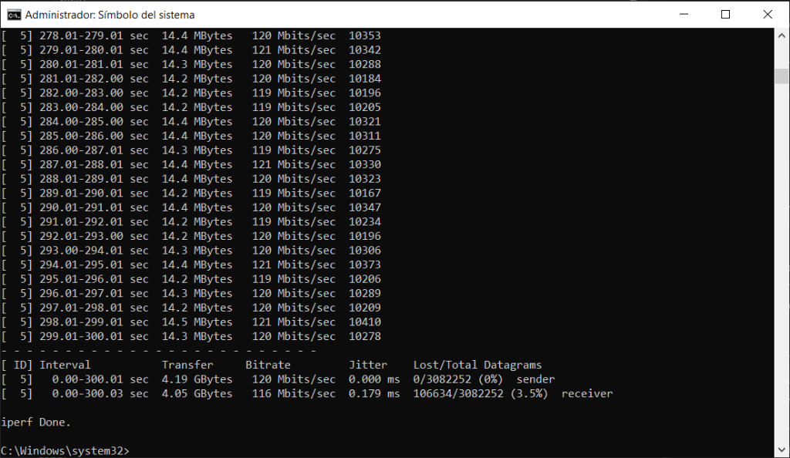
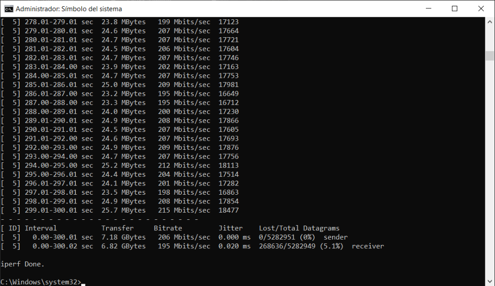

# Registro de Pruebas de Tráfico de Red (iperf3)

Este documento contiene los resultados de las pruebas de estrés e inyección de tráfico de red real realizadas entre el PC VR (cliente) y el PC Robot (servidor), sirviendo como soporte para la sección de experimentos de la memoria del TFG.

---

## 1. Línea Base (Test TCP Estándar)
* **Comando ejecutado (PC VR):**
  ```cmd
  iperf3 -c 192.168.3.27
  ```
* **Fecha/Hora:** 08/07/2026 11:24 (Local)
* **Resultados:**
  * **Duración:** 10 segundos
  * **Ancho de banda medio (Emisor):** **281 Mbps** (335 MBytes transferidos)
  * **Ancho de banda medio (Receptor):** **280 Mbps** (335 MBytes transferidos)
  * **Comportamiento:** Tránsito muy estable a lo largo de todo el periodo, indicando una red local libre de interferencias.
  * **Captura de la Terminal:**
    

---

## 2. Caso: Carga Media (Test UDP - 120 Mbps)
* **Comando ejecutado (PC VR):**
  ```cmd
  iperf3 -c 192.168.3.27 -u -b 120M -t 300
  ```
* **Fecha/Hora:** 08/07/2026 13:12 (Local)
* **Resultados:**
  * **Duración:** 300 segundos (5 minutos)
  * **Tránsito enviado (Sender):** 4.19 GBytes @ **120 Mbits/sec**
  * **Tránsito recibido (Receiver):** 4.05 GBytes @ **116 Mbits/sec**
  * **Jitter medio:** **0.179 ms**
  * **Pérdida de datagramas:** **106,634 / 3,082,252 (3.5%)**
  * **Comportamiento:** Se logra sostener la tasa de inyección de 120 Mbps de manera continua. La pérdida de paquetes es muy baja (3.5%), lo que sitúa esta prueba como un excelente escenario de estrés intermedio.
  * **Captura de la Terminal:**
    

---

## 3. Caso: Carga Alta (Test UDP - 220 Mbps)
* **Comando ejecutado (PC VR):**
  ```cmd
  iperf3 -c 192.168.3.27 -u -b 220M -t 300
  ```
* **Fecha/Hora:** 08/07/2026 13:19 (Local)
* **Resultados:**
  * **Duración:** 300 segundos (5 minutos)
  * **Tránsito enviado (Sender):** 7.18 GBytes @ **206 Mbits/sec**
  * **Tránsito recibido (Receiver):** 6.82 GBytes @ **195 Mbits/sec**
  * **Jitter medio:** **0.020 ms**
  * **Pérdida de datagramas:** **268,636 / 5,282,949 (5.1%)**
  * **Comportamiento:** El canal de red alcanza una carga muy elevada (206 Mbps emitidos). La tasa de pérdida sube al 5.1%, forzando la cola de transmisión y permitiendo simular una congestión severa de red de manera exitosa.
  * **Captura de la Terminal:**
    
