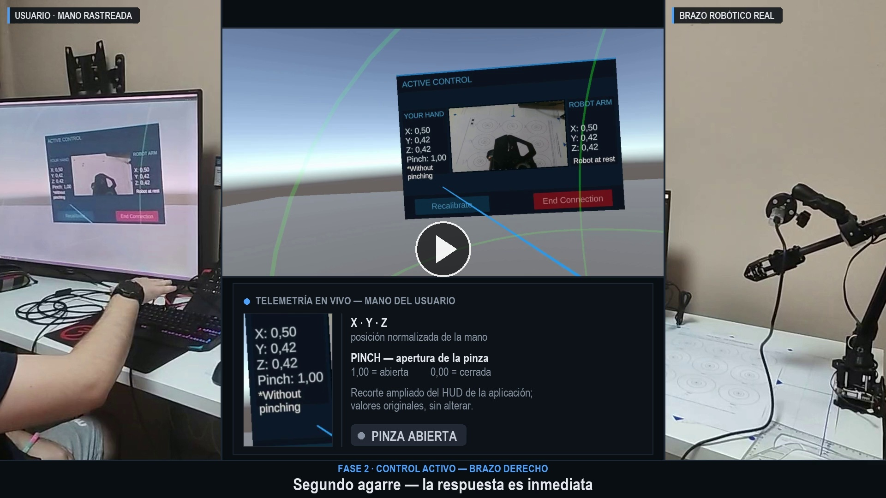

# Teleoperación XR de un brazo robótico RoArm-M2

Trabajo Fin de Grado (Ingeniería Telemática, E.T.S. Ingeniería de Telecomunicación, Universidad de Málaga). Sistema de teleoperación inmersiva de un brazo robótico RoArm-M2 mediante *hand tracking* sin mandos ni sensores externos, con un visor Meta Quest 2, transportando control y vídeo sobre WebRTC de extremo a extremo.

## Vídeo de demostración

> 📹 **[Ver / Descargar vídeo completo narrado (MP4, 1080p, 1:46 min)](docs/media/TFG_demo_brazo_robotico_VR__NARRADO.mp4)**  
> *(Haz clic sobre la imagen superior o en el enlace para abrir y reproducir el vídeo demostrativo con narración explicativa).*

### Fases demostradas en el vídeo

1. **Fase 1 · Calibración inicial (brazo derecho):** El operador, equipado con el visor Meta Quest 2, calibra su rango de movimiento antropométrico mediante XR Hands en 5 segundos para mapear su espacio físico de interacción.
2. **Fase 2 · Control activo y respuesta inmediata:** Teleoperación directa en tiempo real. Se aprecia la baja latencia en el seguimiento de la mano y en el accionamiento de la pinza mediante gesto de *pinch*.
3. **Fase 3 · Rango de movimiento:** Exploración en los tres ejes espaciales (traslaciones lateral, frontal, elevación y descenso) con telemetría HUD en directo y retorno de vídeo *eye-in-hand* recibido vía WebRTC.
4. **Fase 4 · Recalibración dinámica:** Transición rápida en caliente para alternar la teleoperación al brazo izquierdo sin interrumpir la sesión.
5. **Fase 5 · Control activo (brazo izquierdo) y cierre seguro:** Operación con la mano izquierda y desconexión segura y ordenada del canal WebRTC y del brazo robótico.

## ¿Qué hace el sistema?

El operador mueve la mano frente al visor; ese gesto, tras una calibración inicial por usuario, se traduce en comandos de posición para el brazo robótico. El vídeo de una cámara montada en el propio brazo (*eye-in-hand*) se transmite de vuelta al visor en tiempo real, cerrando el lazo de teleoperación. Todo el canal —control y vídeo— viaja sobre WebRTC, instrumentado con métricas de RTT, *jitter*, pérdida y latencia de vídeo de extremo a extremo.

El proyecto se validó con cuatro pruebas funcionales (latencia de control, precisión de posicionado, repetibilidad y una tarea de agarre y colocación) bajo distintas condiciones de red controladas, y se demostró en público el 2 de junio de 2026 durante el EuCNC, en el centro de investigación La Mayora.

## Estructura del repositorio

- **`docs/media/`** — Vídeo demostrativo completo del sistema (`TFG_demo_brazo_robotico_VR__NARRADO.mp4`) y recursos multimedia asociados.
- **`Assets/`** — Proyecto de Unity (visor Meta Quest 2): captura de *hand tracking* (XR Hands), calibración, interfaz de usuario en RV y cliente WebRTC.
- **`PC-ROBOT/`** — Lado del robot, en Python:
  - `Control_Brazo/` — servidor de señalización y cliente WebRTC (`safe8_WebRTC.py`) que traduce los comandos recibidos en movimientos del RoArm-M2 vía puerto serie.
  - `Pruebas_Funcionales/` — scripts de captura, análisis y resultados de las pruebas M1-M4.
  - `Analisis_Datos/`, `Configuracion/`, `Simuladores/`, `tests/` — utilidades de apoyo, configuración y pruebas unitarias.
  - `requirements.txt` — dependencias Python.
- **`Pruebas_Conexion/`** — scripts y resultados de las pruebas de red (perfiles Clumsy, validación *glass-to-glass*, clasificación de sesiones).
- **`Material_Reproducibilidad/`** — plantillas en blanco usadas en las pruebas físicas, para que cualquiera que quiera repetir el experimento tenga el mismo material de partida (ver más abajo).
- **`LEEME_INSTALACION.txt`** — guía paso a paso de instalación y puesta en marcha del entorno Python del PC-ROBOT (dependencias, comandos de arranque, solución de problemas habituales).

## Instalación y puesta en marcha

Ver [`LEEME_INSTALACION.txt`](./LEEME_INSTALACION.txt) para la guía completa (requisitos, entorno virtual, dependencias y comandos de arranque del servidor de señalización y del control del brazo). El lado de Unity requiere un Meta Quest 2 con *hand tracking* activado y el paquete XR Hands instalado en el proyecto.

## Material de reproducibilidad

La carpeta [`Material_Reproducibilidad/`](./Material_Reproducibilidad/) contiene, en blanco y listas para imprimir, las plantillas físicas usadas durante las pruebas funcionales del TFG:

- **`Cuadricula_1cm_A3.pdf`** — cuadrícula de referencia de 1×1 cm en A3, usada para medir a mano el error de posicionado en M2 y M3.
- **`Hoja_Dianas_M2.pdf`** — hoja de dianas (aros de Ø80/40/20/10 mm) para la prueba de precisión de posicionado M2.
- **`Hoja_Registro_M2_M3.pdf`** — hoja de registro en blanco para anotar los intentos de M2 y M3.
- **`Hoja_Registro_M4.pdf`** — hoja de registro en blanco para la prueba de agarre y colocación M4.
- **`NASA_TLX_raw.pdf`** — cuestionario NASA-TLX (Raw TLX) en blanco, usado para medir la carga de trabajo percibida por el operador en M4.

Con esta carpeta más el `requirements.txt` y la guía de instalación, cualquiera que quiera replicar el banco de pruebas parte del mismo material que se usó en este TFG.

## Memoria del TFG

La memoria completa (LaTeX), con la metodología, arquitectura, resultados y discusión detallados, se gestiona en un repositorio aparte, privado hasta la defensa.
